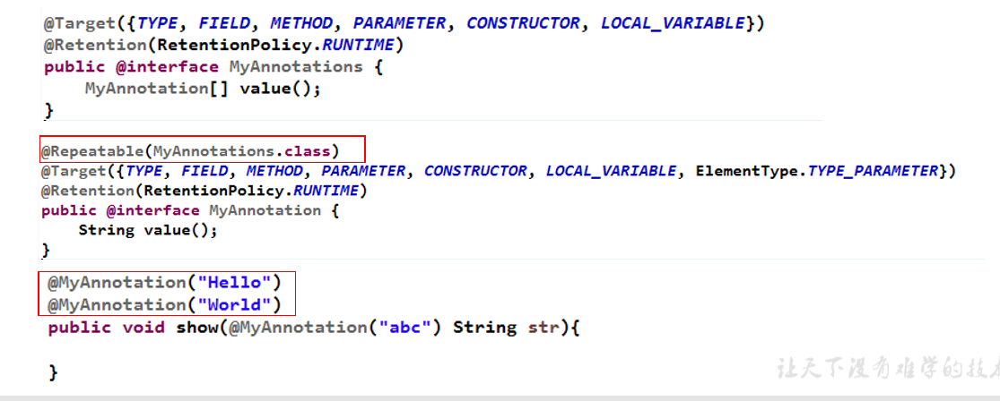
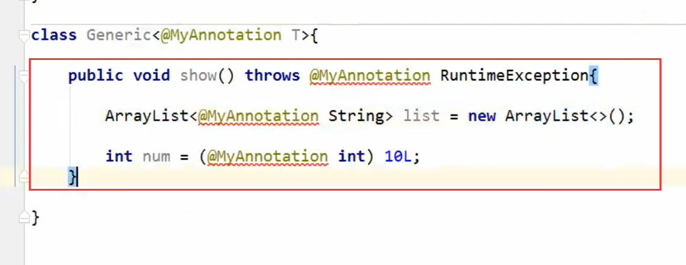

Spring 注解驱动开发


## 注解基础

### 注解的概念与创建

1. 理解annotation

    -  从 JDK 5.0 开始, Java 增加了对元数据(MetaData) 的支持, 也就是 Annotation(注解) 
    -  Annotation 其实就是代码里的特殊标记, 这些标记可以在编译, 类加载, 运行时被读取, 并执行相应的处理。通过使用 Annotation,程序员可以在不改变原有逻辑的情况下, 在源文件中嵌入一些补充信息。
    - Annotation 可以像修饰符一样被使用, 可用于修饰包,类, 构造器, 方 法, 成员变量, 参数, 局部变量的声明, 这些信息被保存在Annotation 的 “name=value” 对中
    - 在JavaSE中，注解的使用目的比较简单，例如标记过时的功能，忽略警告等。在JavaEE/Android中注解占据了更重要的角色，例如用来配置应用程序的任何切面，代替JavaEE旧版中所遗留的繁冗代码和XML配置等。
    -  未来的开发模式都是基于注解的，JPA是基于注解的，Spring2.5以 上都是基于注解的，Hibernate3.x以后也是基于注解的，现在的 Struts2有一部分也是基于注解的了，注解是一种趋势，一定程度上 可以说：框架 = 注解 + 反射 + 设计模式。

 2. Annocation的使用示例

     - 示例一：生成文档相关的注解
     - 示例二：在编译时进行格式检查(JDK内置的三个基本注解)
         @Override: 限定重写父类方法, 该注解只能用于方法
         @Deprecated: 用于表示所修饰的元素(类, 方法等)已过时。通常是因为所修饰的结构危险或存在更好的选择
         @SuppressWarnings: 抑制编译器警告
      - 示例三：跟踪代码依赖性，实现替代配置文件功能

  3. 如何自定义注解：参照@SuppressWarnings定义

     -  定义新的 Annotation 类型使用 @interface 关键字 

     -  自定义注解自动继承了java.lang.annotation.Annotation接口 

     -  Annotation 的成员变量在 Annotation 定义中以无参数方法的形式来声明。其 方法名和返回值定义了该成员的名字和类型。我们称为配置参数。类型只能 是八种基本数据类型、String类型、Class类型、enum类型、Annotation类型、 以上所有类型的数组。 

     -  可以在定义 Annotation 的成员变量时为其指定初始值, 指定成员变量的初始 值可使用 default 关键字 

       例3-1：
     
       ```java
       public @interface MyAnnotation{
           String value() default "hello";
       }
       ```
     
       
     
- 如果只有一个参数成员，建议使用参数名为value 
  
     -  如果定义的注解含有配置参数，那么使用时必须指定参数值，除非它有默认 值。格式是“参数名 = 参数值”，如果只有一个参数成员，且名称为value， 可以省略“value=” 
     
     ​		
     
     -  没有成员定义的 Annotation 称为标记; 包含成员变量的 Annotation 称为元数 据 Annotation 
     
       例：
     
       ```java
       @Target(ElementType.METHOD)
       @Retention(RetentionPolicy.SOURCE)
       public @interface Override {
       }
       ```
     
       注意：
     
       - 如果注解有成员，在使用注解时，需要指明成员的值。如3-1 使用时`@MyAnnotaion(value= 'xxx') `有默认值可以不需要。value可以省略
     
       - 自定义注解必须配上注解的信息处理流程(使用反射)才有意义。
       - 自定义注解通过都会指明两个元注解：Retention、Target
     
       
     
4. jdk 提供的4种元注解

     - 元注解概念： 对现有的注解进行解释说明的注解

     - Retention：指定所修饰的 Annotation 的生命周期：
     
     @Rentention 包含一个 RetentionPolicy 类型的成员变量, 使用 @Rentention 时必须为该 value 成员变量指定值: 
     
     - RetentionPolicy.SOURCE:在源文件中有效（即源文件保留），编译器直接丢弃这种策略的 注释 
          - RetentionPolicy.CLASS:在class文件中有效（即class保留） ， 当运行 Java 程序时, JVM 不会保留注解。 这是默认值 
          - RetentionPolicy.RUNTIME:在运行时有效（即运行时保留），当运行 Java 程序时, JVM 会 保留注释。程序可以通过反射获取该注释。
     
          例如：
     
          ``` java
          @Target(ElementType.METHOD)
          @Retention(RetentionPolicy.SOURCE)
          public @interface Override {
          }
          ```
     
          
     
     - Target:用于指定被修饰的 Annotation 能用于修饰哪些程序元素
     
          | 取值(ElementType) | 作用                                   |
          | ----------------- | -------------------------------------- |
          | CONSTRUCTOR       | 用于描述构造器                         |
          | PACKAGE           | 用于描述包                             |
          | FIELD             | 用于描述域                             |
          | PARAMETER         | 用于描述参数                           |
          | LOCAL_VARIABLE    | 描述局部变量                           |
          | TYPE              | 描述类、接口（包括注解类型）或enum生命 |
          | METHOD            | 描述方法                               |
     
          
     
      *******出现的频率较低*******
     
     - Documented:表示所修饰的注解在被javadoc解析时，保留下来。
     
     - Inherited:被它修饰的 Annotation 将具有继承性。如果某个类使用了被 @Inherited 修饰的 Annotation, 则其子类将自动具有该注解。 
       - 比如：如果把标有@Inherited注解的自定义的注解标注在类级别上，子类则可以 继承父类类级别的注解 
       - 在实际应用中，使用较少
     
5. jdk 8 中注解的新特性： 可重复注解、类型注解

     - 可重复注解：① 在MyAnnotation上声明@Repeatable，成员值为MyAnnotations.class
                           ② MyAnnotation的Target和Retention等元注解与MyAnnotations相同。

                       例子：
                               
                       
                       
     - 类型注解：
     
        - ElementType.TYPE_PARAMETER 表示该注解能写在类型变量的声明语句中（如：泛型声明）。
        
        - ElementType.TYPE_USE 表示该注解能写在使用类型的任何语句中。
        
          可以解决下面3个地方不能添加注解
        
        


### 注解的使用

通过反射获取注解


## 组件添加

```
/**
 * 给容器中注册组件；
 * 1）、包扫描+组件标注注解（@Controller/@Service/@Repository/@Component）[自己写的类]
 * 2）、@Bean[导入的第三方包里面的组件]
 * 3）、@Import[快速给容器中导入一个组件]
 *        1）、@Import(要导入到容器中的组件)；容器中就会自动注册这个组件，id默认是全类名
 *        2）、ImportSelector:返回需要导入的组件的全类名数组；
 *        3）、ImportBeanDefinitionRegistrar:手动注册bean到容器中
 * 4）、使用Spring提供的 FactoryBean（工厂Bean）;
 *        1）、默认获取到的是工厂bean调用getObject创建的对象
 *        2）、要获取工厂Bean本身，我们需要给id前面加一个&
 *           &colorFactoryBean
 */
```


### @ComponentScan

检出需要的组件（扫描出需要的组件）

```java
@Retention(RetentionPolicy.RUNTIME)
@Target({ElementType.TYPE})
@Documented
@Repeatable(ComponentScans.class)
public @interface ComponentScan {
    @AliasFor("basePackages")
    String[] value() default {};

    @AliasFor("value")
    String[] basePackages() default {};

    Class<?>[] basePackageClasses() default {};

    Class<? extends BeanNameGenerator> nameGenerator() default BeanNameGenerator.class;

    Class<? extends ScopeMetadataResolver> scopeResolver() default AnnotationScopeMetadataResolver.class;

    ScopedProxyMode scopedProxy() default ScopedProxyMode.DEFAULT;

    String resourcePattern() default "**/*.class";

    boolean useDefaultFilters() default true;

    ComponentScan.Filter[] includeFilters() default {};

    ComponentScan.Filter[] excludeFilters() default {};

    boolean lazyInit() default false;

    @Retention(RetentionPolicy.RUNTIME)
    @Target({})
    public @interface Filter {
        FilterType type() default FilterType.ANNOTATION;

        @AliasFor("classes")
        Class<?>[] value() default {};

        @AliasFor("value")
        Class<?>[] classes() default {};

        String[] pattern() default {};
    }
}
```


使用：

```
@ComponentScans(
      value = {
            @ComponentScan(value="com.atguigu",includeFilters = {
/*                @Filter(type=FilterType.ANNOTATION,classes={Controller.class}),
                  @Filter(type=FilterType.ASSIGNABLE_TYPE,classes={BookService.class}),*/
                  @Filter(type=FilterType.CUSTOM,classes={MyTypeFilter.class})
            },useDefaultFilters = false)   
      }
      )
```

```
//@ComponentScan  value:指定要扫描的包
//excludeFilters = Filter[] ：指定扫描的时候按照什么规则排除那些组件
//includeFilters = Filter[] ：指定扫描的时候只需要包含哪些组件
//FilterType.ANNOTATION：按照注解
//FilterType.ASSIGNABLE_TYPE：按照给定的类型；
//FilterType.ASPECTJ：使用ASPECTJ表达式
//FilterType.REGEX：使用正则指定
//FilterType.CUSTOM：使用自定义规则
```

- FilterType.CUSTOM：使用自定义规则 需要自己定义Filter

```java
public class MyTypeFilter implements TypeFilter {

	/**
	 * metadataReader：读取到的当前正在扫描的类的信息
	 * metadataReaderFactory:可以获取到其他任何类信息的
	 */
	@Override
	public boolean match(MetadataReader metadataReader, MetadataReaderFactory metadataReaderFactory)
			throws IOException {
		// TODO Auto-generated method stub
		//获取当前类注解的信息
		AnnotationMetadata annotationMetadata = metadataReader.getAnnotationMetadata();
		//获取当前正在扫描的类的类信息
		ClassMetadata classMetadata = metadataReader.getClassMetadata();
		//获取当前类资源（类的路径）
		Resource resource = metadataReader.getResource();
		
		String className = classMetadata.getClassName();
		System.out.println("--->"+className);
		if(className.contains("er")){
			return true;
		}
		return false;
	}

}
```


### @Scope

@Scope 相当于组件的生命周期，填的值都可以在源码中找到 

```
* prototype：多实例的：ioc容器启动并不会去调用方法创建对象放在容器中。
*              每次获取的时候才会调用方法创建对象；
* singleton：单实例的（默认值）：ioc容器启动会调用方法创建对象放到ioc容器中。
*        以后每次获取就是直接从容器（map.get()）中拿，
* request：同一次请求创建一个实例
* session：同一个session创建一个实例
```

```
//  @Scope("prototype")
   @Lazy
   @Bean("person")
   public Person person(){
      System.out.println("给容器中添加Person....");
      return new Person("张三", 25);
   }
```


### @Lazy

```
懒加载：
*     单实例bean：默认在容器启动的时候创建对象；
*     懒加载：容器启动不创建对象。第一次使用(获取)Bean创建对象，并初始化；
```


### @Conditional

 按照一定的条件进行判断，满足条件给容器中注册bean


```java
@Target({ElementType.TYPE, ElementType.METHOD})
@Retention(RetentionPolicy.RUNTIME)
@Documented
public @interface Conditional {
	Class<? extends Condition>[] value();
}
```


value填入Condition类数组

```
//判断是否linux系统
public class LinuxCondition implements Condition {

   /**
    * ConditionContext：判断条件能使用的上下文（环境）
    * AnnotatedTypeMetadata：注释信息
    */
   @Override
   public boolean matches(ConditionContext context, AnnotatedTypeMetadata metadata) {
      // TODO是否linux系统
      //1、能获取到ioc使用的beanfactory
      ConfigurableListableBeanFactory beanFactory = context.getBeanFactory();
      //2、获取类加载器
      ClassLoader classLoader = context.getClassLoader();
      //3、获取当前环境信息
      Environment environment = context.getEnvironment();
      //4、获取到bean定义的注册类
      BeanDefinitionRegistry registry = context.getRegistry();
      
      String property = environment.getProperty("os.name");
      
      //可以判断容器中的bean注册情况，也可以给容器中注册bean
      boolean definition = registry.containsBeanDefinition("person");
      if(property.contains("linux")){
         return true;
      }
      
      return false;
   }

}
```


使用：

```
@Conditional(LinuxCondition.class)
@Bean("linus")
public Person person02(){
   return new Person("linus", 48);
}
```


使用2： 放到类上面

```
//类中组件统一设置。满足当前条件，这个类中配置的所有bean注册才能生效；
@Conditional({WindowsCondition.class})
@Configuration
public class MainConfig2 {}
```


### @Import

快速给容器导入组件

```
@Target(ElementType.TYPE)
@Retention(RetentionPolicy.RUNTIME)
@Documented
public @interface Import {

   /**
    * {@link Configuration}, {@link ImportSelector}, {@link ImportBeanDefinitionRegistrar}
    * or regular component classes to import.
    */
   Class<?>[] value();

}
```

#### 普通使用：

id默认是组件的全类名

```
@Import({Color.class,Red.class)
//@Import导入组件，id默认是组件的全类名
public class MainConfig2 {}
```

#### 使用ImportSelector：

返回需要导入的组件的全类名数组

```
//自定义逻辑返回需要导入的组件
public class MyImportSelector implements ImportSelector {

   //返回值，就是到导入到容器中的组件全类名
   //AnnotationMetadata:当前标注@Import注解的类的所有注解信息
   @Override
   public String[] selectImports(AnnotationMetadata importingClassMetadata) {
      // TODO Auto-generated method stub
      //importingClassMetadata
      //方法不要返回null值
      return new String[]{"com.atguigu.bean.Blue","com.atguigu.bean.Yellow"};
   }

}
```


使用：

```java
@Import({Color.class,Red.class, MyImportSelector.class)
//@Import导入组件，id默认是组件的全类名
public class MainConfig2 {}
```


#### 使用ImportBeanDefinitionRegistrar

通过接口提供的BeanDefinitionRegistry对象来进行注册

```
public class MyImportBeanDefinitionRegistrar implements ImportBeanDefinitionRegistrar {

   /**
    * AnnotationMetadata：当前类的注解信息
    * BeanDefinitionRegistry:BeanDefinition注册类；
    *        把所有需要添加到容器中的bean；调用
    *        BeanDefinitionRegistry.registerBeanDefinition手工注册进来
    */
   @Override
   public void registerBeanDefinitions(AnnotationMetadata importingClassMetadata, BeanDefinitionRegistry registry) {
      
      boolean definition = registry.containsBeanDefinition("com.atguigu.bean.Red");
      boolean definition2 = registry.containsBeanDefinition("com.atguigu.bean.Blue");
      if(definition && definition2){
         //指定Bean定义信息；（Bean的类型，Bean。。。）
         RootBeanDefinition beanDefinition = new RootBeanDefinition(RainBow.class);
         //注册一个Bean，指定bean名
         registry.registerBeanDefinition("rainBow", beanDefinition);
      }
   }

}
```

### FactoryBean

 1）、默认获取到的是工厂bean调用getObject创建的对象

2）、要获取工厂Bean本身，我们需要给id前面加一个&colorFactoryBean

```java
public interface FactoryBean<T> {

	T getObject() throws Exception;

	Class<?> getObjectType();

	boolean isSingleton();

}

```


使用：第一步创建工厂bean

```java
//创建一个Spring定义的FactoryBean
public class ColorFactoryBean implements FactoryBean<Color> {

	//返回一个Color对象，这个对象会添加到容器中
	@Override
	public Color getObject() throws Exception {
		System.out.println("ColorFactoryBean...getObject...");
		return new Color();
	}

	@Override
	public Class<?> getObjectType() {
		return Color.class;
	}

	//是单例？
	//true：这个bean是单实例，在容器中保存一份
	//false：多实例，每次获取都会创建一个新的bean；
	@Override
	public boolean isSingleton() {
		return false;
	}

}
```


第二步：配置文件上使用

```
@Configuration
public class MainConfig2 {
	@Bean
	public ColorFactoryBean colorFactoryBean(){
		return new ColorFactoryBean();
	}
}
```


第三步：获取对象使用

```
@Test
public void test1() {
    //工厂Bean获取的是调用getObject创建的对象
    Object bean2 = applicationContext.getBean("colorFactoryBean");
    Object bean3 = applicationContext.getBean("colorFactoryBean");
    System.out.println("bean的类型："+bean2.getClass());
    System.out.println(bean2 == bean3);
	
	// 获取工厂本身
    Object bean4 = applicationContext.getBean("&colorFactoryBean");
    System.out.println(bean4.getClass());
}

```


## bean 生命周期注解

- bean的生命周期：  bean创建---初始化----销毁的过程

  - 创建时机：
    -  单实例：在容器启动的时候创建对象（可以配置懒加载修改）
    - 多实例：在每次获取的时候创建对象
  - 销毁时机：
     *        单实例：容器关闭的时候
     *        多实例：容器不会管理这个bean；容器不会调用销毁方法；

  

- 自定义初始化和销毁方法：

  1）、指定初始化和销毁方法；

   	通过@Bean指定init-method和destroy-method；

  ```java
@Configuration
  public class MainConfigOfLifeCycle {
				
  	//@Scope("prototype")
  	@Bean(initMethod="init",destroyMethod="detory")
  	public Car car(){
  		return new Car();
  	}
  
  }

  public class Car {
				
  	public Car(){
  ```

		System.out.println("car constructor...");
  	}
  	
  	public void init(){
  		System.out.println("car ... init...");
  	}
  	
  	public void detory(){
  		System.out.println("car ... detory...");
  	}

  }
  ```
  
  
  
  
  
  2）、通过让Bean实现InitializingBean（定义初始化逻辑），DisposableBean（定义销毁逻辑）;
  
  ```java
  public interface InitializingBean {
  	void afterPropertiesSet() throws Exception;
  }
  public interface DisposableBean {
  	void destroy() throws Exception;
  }
  ```

  

  ```java
  public class Cat implements InitializingBean,DisposableBean {
  	
  	public Cat(){
  		System.out.println("cat constructor...");
  	}
  
  	@Override
  	public void destroy() throws Exception {
  		System.out.println("cat...destroy...");
  	}
  
  	@Override
  	public void afterPropertiesSet() throws Exception {
  		System.out.println("cat...afterPropertiesSet...");
  	}
  }
  
  @Configuration
  public class MainConfigOfLifeCycle {
  	
  	@Bean
  	public Car car(){
  		return new Car();
  	}
  
  }
  ```

  

  

  

  3）、可以使用JSR250；
           @PostConstruct：在bean创建完成并且属性赋值完成；来执行初始化方法
           @PreDestroy：在容器销毁bean之前通知我们进行清理工作

  ```
  public class Dog {
       
     public Dog(){
        System.out.println("dog constructor...");
     }
     
     //对象创建并赋值之后调用
     @PostConstruct
     public void init(){
        System.out.println("Dog....@PostConstruct...");
     }
     
     //容器移除对象之前
     @PreDestroy
     public void detory(){
        System.out.println("Dog....@PreDestroy...");
     }
  
     @Override
     public void setApplicationContext(ApplicationContext applicationContext) throws BeansException {
        this.applicationContext = applicationContext;
     }
  }
  ```

  

   4）、BeanPostProcessor【interface】：bean的后置处理器；
           在bean初始化前后进行一些处理工作；

  ```
  public interface BeanPostProcessor {
  	// 在初始化之前工作
     Object postProcessBeforeInitialization(Object bean, String beanName) throws BeansException;
  	// :在初始化之后工作
     Object postProcessAfterInitialization(Object bean, String beanName) throws BeansException;
  
  }
  ```

  ```java
@Conponent  
public class MyBeanPostProcessor implements BeanPostProcessor {
  
     @Override
     public Object postProcessBeforeInitialization(Object bean, String beanName) throws BeansException {
        System.out.println("postProcessBeforeInitialization..."+beanName+"=>"+bean);
        return bean;
     }
  
     @Override
     public Object postProcessAfterInitialization(Object bean, String beanName) throws BeansException {
        System.out.println("postProcessAfterInitialization..."+beanName+"=>"+bean);
        return bean;
     }
  
  }
  ```

  

BeanPostProcessor是生命周期函数最底层的方法：

```
bean赋值，注入其他组件，@Autowired，生命周期注解功能，@Async,等等都是依赖 BeanPostProcessor完成的;
```


## 组件赋值

### @Value


```
public class Person {
   
   //使用@Value赋值；
   //1、基本数值
   //2、可以写SpEL； #{}
   //3、可以写${}；取出配置文件【properties】中的值（在运行环境变量里面的值）
   
   @Value("张三")
   private String name;
   @Value("#{20-2}")
   private Integer age;
   
   // 需要用@propertySource 加载properties
   @Value("${person.nickName}") 
   private String nickName;
}
   
```


### @PropertySource 加载properties

```
//使用@PropertySource读取外部配置文件中的k/v保存到运行的环境变量中;加载完外部的配置文件以后使用${}取出配置文件的值
@PropertySource(value={"classpath:/person.properties"})
@Configuration
public class MainConfigOfPropertyValues {
   
   @Bean
   public Person person(){
      return new Person();
   }

}
```

```
// 从环境变量中取出 properties 加载的k/v值
	AnnotationConfigApplicationContext applicationContext = new AnnotationConfigApplicationContext(MainConfigOfPropertyValues.class);

ConfigurableEnvironment environment = applicationContext.getEnvironment();
String property = environment.getProperty("person.nickName");
```


@PropertySource源码

```
@Target(ElementType.TYPE)
@Retention(RetentionPolicy.RUNTIME)
@Documented
@Repeatable(PropertySources.class) // 可以配置多个@PropertySource
public @interface PropertySource {

   String name() default "";

   String[] value();

   boolean ignoreResourceNotFound() default false;

   String encoding() default "";

   Class<? extends PropertySourceFactory> factory() default PropertySourceFactory.class;

}
```


## 自动注入

### @Autowired 自动注入

1）、默认优先按照类型去容器中找对应的组件:applicationContext.getBean(BookDao.class);找到就赋值
2）、如果找到多个相同类型的组件，再将属性的名称作为组件的id去容器中查找
					applicationContext.getBean("bookDao2")

```java
BookService{
    @Autowired
    BookDao  bookDao2; 
    // 会根据 属性名bookDao2去容器中找
    // 	applicationContext.getBean("bookDao2")
}

@Configuration
public class MainConfig {
   
   @Bean
   public BookDao bookDao(){
      return new BookDao();
   }
    @Bean（"bookDao2"）
   public BookDao bookDao2(){
      return new BookDao();
   }

}
```

3）、@Qualifier("bookDao")：使用@Qualifier指定需要装配的组件的id，而不是使用属性名

4）、自动装配默认一定要将属性赋值好，没有就会报错；
	可以使用@Autowired(required=false);

```
@Service
public class BookService {
   
   @Qualifier("bookDao")
   @Autowired(required=false)
   private BookDao bookDao;

}
```


5）、@Primary：让Spring进行自动装配的时候，默认使用首选的bean；
		也可以继续使用@Qualifier指定需要装配的bean的名字

```java
BookService{
    @Autowired
    BookDao  bookDao2; 
	// 由于有@Parimay 这里注入的是bookDao
}

@Configuration
public class MainConfig {
   
   @Primary
   @Bean
   public BookDao bookDao(){
      return new BookDao();
   }
    @Bean（"bookDao2"）
   public BookDao bookDao2(){
      return new BookDao();
   }

}
```


### JSR 规范 @Resource 与 @Inject 注入

Spring还支持使用@Resource(JSR250)和@Inject(JSR330)[java规范的注解]
#### @Resource: 

可以和@Autowired一样实现自动装配功能；默认是按照组件名称进行装配的；
没有能支持@Primary功能没有支持@Autowired（reqiured=false）;

####  @Inject:
需要导入javax.inject的包，和Autowired的功能一样。没有required=false的功能；

<strong>·@Autowired:Spring定义的； @Resource、@Inject都是java规范</strong>
	

### 自动注入总结： @Autowired 牛逼，就用 @Autowired

自动注入实现的原理

​	AutowiredAnnotationBeanPostProcessor:解析完成自动装配功能；    

### 自动配置位置

@Autowired:构造器，参数，方法，属性；都是从容器中获取参数组件的值

 1）、[标注在方法位置]：@Bean+方法参数；参数从容器中获取;默认不写@Autowired效果是一样的；都能自动装配

```java
	@Autowired 
	public void setCar(Car car) {
		this.car = car;
	}
```


2）、[标在构造器上]：如果组件只有一个有参构造器，这个有参构造器的@Autowired可以省略，参数位置的组件还是可以自动从容器中获取

```java
@Component
public class Boss {
	
	private Car car;
	
	//构造器要用的组件，都是从容器中获取, 如果只有一个有参构造器@Autowired可以省略
    @Autowired
	public Boss(Car car){
		this.car = car;
		System.out.println("Boss...有参构造器");
	}
}
```


3）、放在参数位置：

@Component
public class Boss {
	
	@Component
	public class Boss {
		
		private Car car;
		
		//构造器要用的组件，都是从容器中获取, 如果只有一个有参构造器@Autowired可以省略
		public Boss(@Autowired Car car){
			this.car = car;
			System.out.println("Boss...有参构造器");
		}
	}
4）、@Bean方法参数的bean从容器中去

```java
// 这里方法的car 可以从容器中取
@Bean
public Color color(Car car){
    Color color = new Color();
    color.setCar(car);
    return color;
}
```


### 自定义组件获取Spring底层组件

自定义组件想要使用Spring容器底层的一些组件（ApplicationContext，BeanFactory，xxx）；

自定义组件实现xxxAware；在创建对象的时候，会调用接口规定的方法注入相关组件；Aware；

把Spring底层一些组件注入到自定义的Bean中；

 xxxAware：功能使用xxxProcessor；

 	ApplicationContextAware==》ApplicationContextAwareProcessor；

``` java
@Component
public class Red implements ApplicationContextAware,BeanNameAware,EmbeddedValueResolverAware {
	
	private ApplicationContext applicationContext;

	@Override
	public void setApplicationContext(ApplicationContext applicationContext) throws BeansException {
		System.out.println("传入的ioc："+applicationContext);
		this.applicationContext = applicationContext;
	}

	@Override
	public void setBeanName(String name) {
		System.out.println("当前bean的名字："+name);
	}

	@Override
	public void setEmbeddedValueResolver(StringValueResolver resolver) {
		String resolveStringValue = resolver.resolveStringValue("你好 ${os.name} 我是 #{20*18}");
		System.out.println("解析的字符串："+resolveStringValue);
	}


}
```


### @Profile

```
/**
 * Profile：
 *        Spring为我们提供的可以根据当前环境，动态的激活和切换一系列组件的功能；
 * 
 * 开发环境、测试环境、生产环境；
 * 数据源：(/A)(/B)(/C)；
 * 
 * 
 * @Profile：指定组件在哪个环境的情况下才能被注册到容器中，不指定，任何环境下都能注册这个组件
 * 
 * 1）、加了环境标识的bean，只有这个环境被激活的时候才能注册到容器中。默认是default环境
 * 2）、写在配置类上，只有是指定的环境的时候，整个配置类里面的所有配置才能开始生效
 * 3）、没有标注环境标识的bean在，任何环境下都是加载的；
 */

@PropertySource("classpath:/dbconfig.properties")
@Configuration
public class MainConfigOfProfile implements EmbeddedValueResolverAware{
   
   @Value("${db.user}")
   private String user;
   
   private StringValueResolver valueResolver;
   
   private String  driverClass;
   
   
   @Bean
   public Yellow yellow(){
      return new Yellow();
   }
   
   @Profile("test")
   @Bean("testDataSource")
   public DataSource dataSourceTest(@Value("${db.password}")String pwd) throws Exception{
      ComboPooledDataSource dataSource = new ComboPooledDataSource();
      dataSource.setUser(user);
      dataSource.setPassword(pwd);
      dataSource.setJdbcUrl("jdbc:mysql://localhost:3306/test");
      dataSource.setDriverClass(driverClass);
      return dataSource;
   }
   
   
   @Profile("dev")
   @Bean("devDataSource")
   public DataSource dataSourceDev(@Value("${db.password}")String pwd) throws Exception{
      ComboPooledDataSource dataSource = new ComboPooledDataSource();
      dataSource.setUser(user);
      dataSource.setPassword(pwd);
      dataSource.setJdbcUrl("jdbc:mysql://localhost:3306/ssm_crud");
      dataSource.setDriverClass(driverClass);
      return dataSource;
   }
   
   @Profile("prod")
   @Bean("prodDataSource")
   public DataSource dataSourceProd(@Value("${db.password}")String pwd) throws Exception{
      ComboPooledDataSource dataSource = new ComboPooledDataSource();
      dataSource.setUser(user);
      dataSource.setPassword(pwd);
      dataSource.setJdbcUrl("jdbc:mysql://localhost:3306/scw_0515");
      
      dataSource.setDriverClass(driverClass);
      return dataSource;
   }

   @Override
   public void setEmbeddedValueResolver(StringValueResolver resolver) {
      // TODO Auto-generated method stub
      this.valueResolver = resolver;
      driverClass = valueResolver.resolveStringValue("${db.driverClass}");
   }

}
```

激活Profile

```
//1、使用命令行动态参数: 在虚拟机参数位置加载 -Dspring.profiles.active=test
//2、代码的方式激活某种环境；
@Test
public void test01(){
   AnnotationConfigApplicationContext applicationContext = 
         new AnnotationConfigApplicationContext();
   //1、创建一个applicationContext
   //2、设置需要激活的环境
   applicationContext.getEnvironment().setActiveProfiles("dev");
   //3、注册主配置类
   applicationContext.register(MainConfigOfProfile.class);
   //4、启动刷新容器
   applicationContext.refresh();
   
   
   String[] namesForType = applicationContext.getBeanNamesForType(DataSource.class);
   for (String string : namesForType) {
      System.out.println(string);
   }
   
   Yellow bean = applicationContext.getBean(Yellow.class);
   System.out.println(bean);
   applicationContext.close();
}
```


## AOP

AOP：【动态代理】指在程序运行期间动态的将某段代码切入到指定方法指定位置进行运行的编程方式；

### AOP的基本使用

1. 导入aop模块；Spring AOP：(spring-aspects)

   ```xml
   <dependency>
       <groupId>org.springframework</groupId>
       <artifactId>spring-aspects</artifactId>
       <version>4.3.12.RELEASE</version>
   </dependency>
   ```

   

2. 定义一个业务逻辑类（MathCalculator）；在业务逻辑运行的时候将日志进行打印（方法之前、方法运行结束、方法出现异常，xxx）

   ```java
   public class MathCalculator {
   	
   	public int div(int i,int j){
   		System.out.println("MathCalculator...div...");
   		return i/j;	
   	}
   
   }
   ```

   

3. 定义一个日志切面类（LogAspects）：切面类里面的方法需要动态感知MathCalculator.div运行到哪里然后执行；
   		通知方法：
   			前置通知(@Before)：logStart：在目标方法(div)运行之前运行
   			后置通知(@After)：logEnd：在目标方法(div)运行结束之后运行（无论方法正常结束还是异常结束）
   			返回通知(@AfterReturning)：logReturn：在目标方法(div)正常返回之后运行
   			异常通知(@AfterThrowing)：logException：在目标方法(div)出现异常以后运行
   			环绕通知(@Around)：动态代理，手动推进目标方法运行（joinPoint.procced()）

   ```java
   // @Aspect 是用来告诉容器这个是切面类
   @Aspect
   public class LogAspects {
   	
   	//抽取公共的切入点表达式
   	//1、本类引用
   	//2、其他的切面引用
   	@Pointcut("execution(public int com.atguigu.aop.MathCalculator.*(..))")
   	public void pointCut(){};
   	
   	//@Before在目标方法之前切入；切入点表达式（指定在哪个方法切入）
   	@Before("pointCut()")
   	public void logStart(JoinPoint joinPoint){
   		Object[] args = joinPoint.getArgs();
   		System.out.println(""+joinPoint.getSignature().getName()+"运行。。。@Before:参数列表是：{"+Arrays.asList(args)+"}");
   	}
   	
       // 如果使用其他切面需要引入全路径
   	@After("com.atguigu.aop.LogAspects.pointCut()")
   	public void logEnd(JoinPoint joinPoint){
   		System.out.println(""+joinPoint.getSignature().getName()+"结束。。。@After");
   	}
   	
   	//JoinPoint一定要出现在参数表的第一位
   	@AfterReturning(value="pointCut()",returning="result")
   	public void logReturn(JoinPoint joinPoint,Object result){
   		System.out.println(""+joinPoint.getSignature().getName()+"正常返回。。。@AfterReturning:运行结果：{"+result+"}");
   	}
   	
       // throwing = "exception" 必须声明，否则spring 无法注入异常
   	@AfterThrowing(value="pointCut()",throwing="exception")
   	public void logException(JoinPoint joinPoint,Exception exception){
   		System.out.println(""+joinPoint.getSignature().getName()+"异常。。。异常信息：{"+exception+"}");
   	}
   
   }
   ```

   

4. 给切面类的目标方法标注何时何地运行（通知注解）；

   前置通知(@Before)、后置通知(@After)、返回通知(@AfterReturning)、异常通知(@AfterThrowing)、环绕通知(@Around)

5. 将切面类和业务逻辑类（目标方法所在类）都加入到容器中;

6. 必须告诉Spring哪个类是切面类(给切面类上加一个注解：@Aspect)

7. 给配置类中加 @EnableAspectJAutoProxy 【开启基于注解的aop模式】
   		在Spring中很多的 @EnableXXX;

   ``` java
   @EnableAspectJAutoProxy
   @Configuration
   public class MainConfigOfAOP {
   	 
   	//业务逻辑类加入容器中
   	@Bean
   	public MathCalculator calculator(){
   		return new MathCalculator();
   	}
   
   	//切面类加入到容器中
   	@Bean
   	public LogAspects logAspects(){
   		return new LogAspects();
   	}
   }
   
   ```

   

#### 最主要三步：
	1. 将业务逻辑组件和切面类都加入到容器中；告诉Spring哪个是切面类（@Aspect）
 	2. 在切面类上的每一个通知方法上标注通知注解，告诉Spring何时何地运行（切入点表达式）
 	3. 开启基于注解的aop模式；@EnableAspectJAutoProxy


### AOP原理

